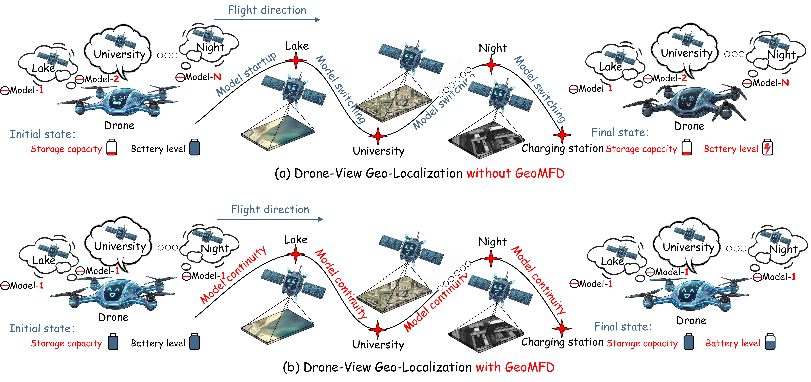
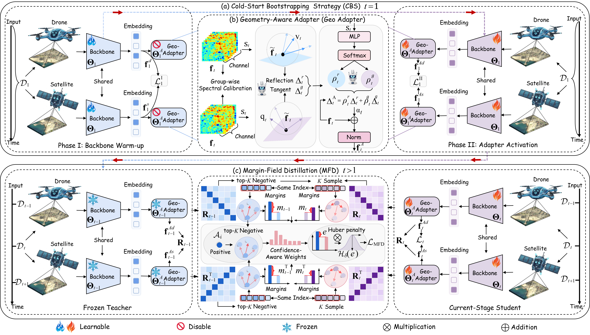

## GeoMFD 2026 [[Paper](https://arxiv.org/abs/2607.25788)] [[Models](#pre-trained-checkpoints)] [[Cite](#citation)]

<p align="left">
  
</p>

<h1 align="center">GeoMFD: Continual Drone-View Geo-Localization with Geometry-Aware Adapter and Margin-Field Distillation</h1>

<h3 align="center">
  <strong>Zhongwei Chen</strong><sup>1,2,3</sup>,
  <strong>Haijun Rong</strong><sup>1,2,3</sup>,
  <strong>Tao Zhang</strong><sup>1,2,3</sup>,
  <strong>Xianfeng Nie</strong><sup>1,2,3</sup>,
  <strong>Xiangbao Zhang</strong><sup>1,2,3</sup>,<br>
  <strong>Guoqi Li*</strong><sup>4,5,6</sup>,
  <strong>Zhaoxu Yang*</strong><sup>1,2,3</sup>
</h3>

<div align="center">
  <sup>1</sup>School of Aerospace Engineering, Xi'an Jiaotong University, China<br>
  <sup>2</sup>State Key Laboratory for Strength and Vibration of Mechanical Structures<br>
  <sup>3</sup>Shaanxi Key Laboratory of Environment and Control for Flight Vehicle<br>
  <sup>4</sup>Institute of Automation, Chinese Academy of Sciences, China<br>
  <sup>5</sup>School of Artificial Intelligence, University of Chinese Academy of Sciences<br>
  <sup>6</sup>Peng Cheng Laboratory<br>
  <sup>*</sup>Corresponding authors
</div>

<div align="center">
  <p>
    <a href="https://arxiv.org/abs/2607.25788"></a>
    <a href="#pre-trained-checkpoints"></a>
    <a href="LICENSE"></a>
  </p>
</div>

This repository provides the official implementation of **GeoMFD: Continual Drone-View Geo-Localization with Geometry-Aware Adapter and Margin-Field Distillation**.

GeoMFD studies **Continual Drone-View Geo-Localization (C-DVGL)**, where a single retrieval model is sequentially updated as new environments arrive. Unlike the conventional closed-world DVGL setting, C-DVGL requires the model to adapt to new environmental distributions while preserving the cross-view retrieval geometry learned from previously seen environments.

GeoMFD addresses this stability-plasticity challenge through three complementary components: **Cold-start Bootstrapping (CBS)**, a **Geometry-Aware Adapter (Geo-Adapter)**, and **Margin-Field Distillation (MFD)**. Together, they enable continual adaptation while reducing distortion of previously learned positive-versus-hard-negative relationships in the embedding space.

The implementation covers experiments on
[University-1652](https://github.com/layumi/University1652-Baseline),
[SUES-200](https://github.com/Reza-Zhu/SUES-200-Benchmark),
[DenseUAV](https://github.com/Dmmm1997/DenseUAV),
[IR-VL328](https://github.com/liutao23/ODGNNLoc), and
[CVGL-RGBT](https://github.com/cver6/CDM-Net).

## <a id="motivation"></a>💡 Motivation

<p align="center">
  
</p>

Most existing DVGL methods are developed under a **static closed-world assumption**: training data from the target environments are available in advance, and the deployment distribution is assumed to remain fixed. Real-world drone platforms, however, may encounter environments sequentially, with changes in illumination, viewpoint, altitude, scene structure, and sensing conditions.

A straightforward solution is to train or maintain a separate model for each environment, but this introduces additional storage, deployment, and model-selection costs. Continually updating a single model is more practical, yet naïve adaptation can distort the previously learned cross-view embedding space and cause severe forgetting. GeoMFD therefore focuses on preserving the **relative retrieval geometry between positive pairs and hard negatives** while still allowing the model to learn newly encountered environments.

## <a id="method-overview"></a>🧩 Method Overview

<p align="center">
  
</p>

GeoMFD continuously updates one DVGL model across a sequence of environments. Its design contains three main components:

- **Cold-start Bootstrapping (CBS).** The first environment is used to establish a stable cross-view embedding space. Training first warms up the shared backbone with the adapter disabled, and then activates the adapter for stable residual adaptation. This provides a reliable geometric basis for subsequent continual learning stages.

- **Geometry-Aware Adapter (Geo-Adapter).** Instead of freely modifying the whole representation space, the adapter performs controlled residual corrections in the normalized embedding space. It combines group-wise calibration with geometry-aware residual transformations and adaptive gating, allowing the model to accommodate new environments while limiting unnecessary distortion of previously learned cross-view relationships.

- **Margin-Field Distillation (MFD).** At later stages, the frozen previous model serves as a teacher. Rather than matching features independently, MFD preserves the relative similarity margins between positive cross-view pairs and their hard negatives. This directly regularizes the retrieval geometry that matters for geo-localization and reduces catastrophic forgetting without storing data from previous environments.

These components work together to balance **plasticity** for newly arriving environments and **stability** for previously learned cross-view retrieval knowledge.

## <a id="visualization"></a>🔍 Qualitative Visualization

<p align="center">
  
</p>

The qualitative visualization complements the quantitative evaluation by illustrating cross-view retrieval behavior under continual environment updates. It highlights the central goal of GeoMFD: maintaining discriminative correspondence between drone and satellite observations after sequential adaptation, instead of allowing previously established retrieval relationships to collapse as new environments are learned.

## <a id="news"></a>🔥 News

- **July 2026:** GeoMFD is available on [arXiv](https://arxiv.org/abs/2607.25788). 🎉
- Training code, evaluation code, and pre-trained checkpoints are being organized in this repository.

---

## <a id="table-of-contents"></a>📚 Table of Contents

- [Motivation](#motivation)
- [Method Overview](#method-overview)
- [Qualitative Visualization](#visualization)
- [Highlights](#highlights)
- [TODOs](#todos)
- [Dataset Access](#dataset-access)
- [Train and Test](#train-and-test)
- [Pre-trained Checkpoints](#pre-trained-checkpoints)
- [License](#license)
- [Acknowledgments](#acknowledgments)
- [Citation](#citation)

## <a id="highlights"></a>✨ Highlights

- Introduces **Continual Drone-View Geo-Localization (C-DVGL)**, where a single model is sequentially updated across changing environments.
- Identifies continual DVGL forgetting as distortion of **cross-view retrieval geometry**, particularly the relative margins between positive pairs and hard negatives.
- Proposes **CBS** to establish a stable initial embedding space before continual adaptation.
- Introduces a **Geometry-Aware Adapter** for controlled representation updates in normalized embedding space.
- Introduces **Margin-Field Distillation** to preserve positive-versus-hard-negative similarity margins from the previous model without retaining historical training data.
- Evaluates continual geo-localization across five representative drone-view geo-localization datasets covering diverse visual and sensing conditions.

## <a id="todos"></a>📜 TODOs

- [x] Release the **training** code.
- [x] Release the **evaluation** code.
- [x] Release the **pre-trained GeoMFD checkpoints**.
- [ ] Add detailed training and evaluation instructions.
- [ ] Add additional visualization and analysis tools.

## <a id="dataset-access"></a>💾 Dataset Access

Please download and prepare the following datasets:

- [University-1652](https://github.com/layumi/University1652-Baseline)
- [SUES-200](https://github.com/Reza-Zhu/SUES-200-Benchmark)
- [DenseUAV](https://github.com/Dmmm1997/DenseUAV)
- [IR-VL328](https://github.com/liutao23/ODGNNLoc)
- [CVGL-RGBT](https://github.com/cver6/CDM-Net)

Please follow the official instructions of each dataset for downloading and preparation.

## <a id="train-and-test"></a>🚀 Train and Test

Detailed commands for continual training and evaluation will be provided here.

```text
Please look forward to it.
```

## <a id="pre-trained-checkpoints"></a>🤗 Pre-trained Checkpoints

We provide the trained GeoMFD models for reproducing the experiments reported in the paper.

```text
Please look forward to it.
```

## <a id="license"></a>🎫 License

This project is licensed under the [Apache License 2.0](LICENSE).

## <a id="acknowledgments"></a>🙏 Acknowledgments

This repository builds upon the following drone-view geo-localization benchmarks and repositories:

- [University-1652](https://github.com/layumi/University1652-Baseline)
- [SUES-200](https://github.com/Reza-Zhu/SUES-200-Benchmark)
- [DenseUAV](https://github.com/Dmmm1997/DenseUAV)
- [IR-VL328](https://github.com/liutao23/ODGNNLoc)
- [CVGL-RGBT](https://github.com/cver6/CDM-Net)

We thank the authors for making their excellent work and datasets publicly available.

## <a id="citation"></a>📌 Citation

If you find this work useful in your research, please cite:

```bibtex
@article{chen2026geomfd,
  title   = {GeoMFD: Continual Drone-View Geo-Localization with Geometry-Aware Adapter and Margin-Field Distillation},
  author  = {Chen, Zhongwei and Rong, Haijun and Zhang, Tao and Nie, Xianfeng and Zhang, Xiangbao and Li, Guoqi and Yang, Zhaoxu},
  journal = {arXiv preprint arXiv:2607.25788},
  year    = {2026}
}
```
